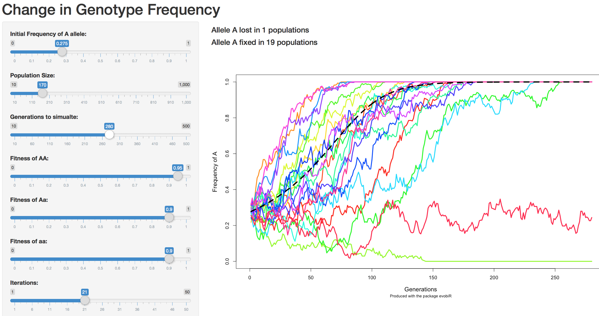
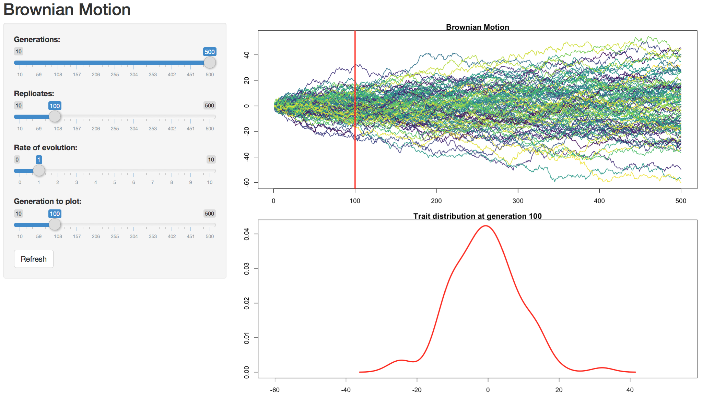
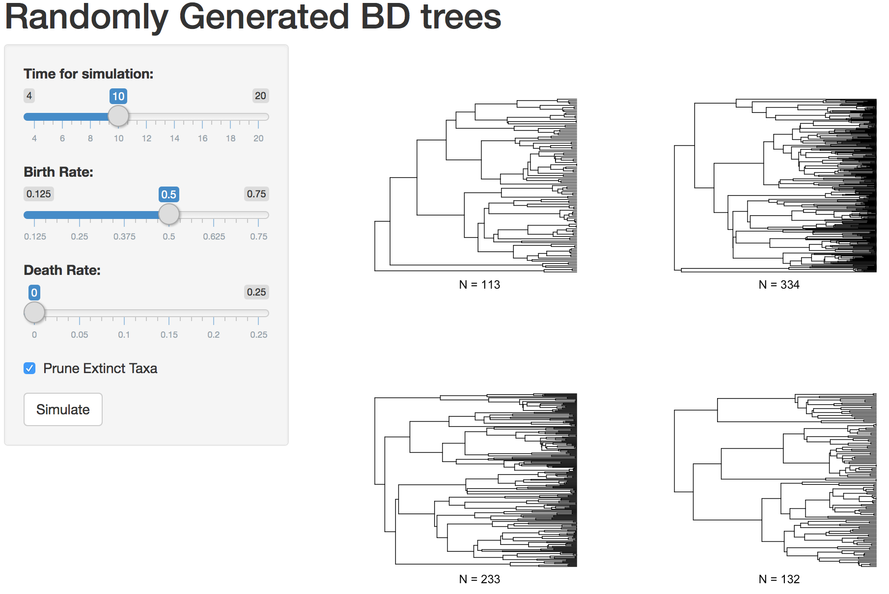
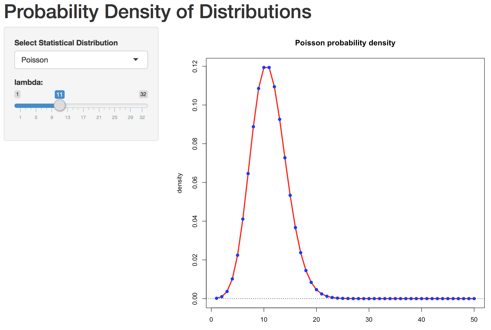

_______
# Installing

A stable tested version of evobiR is available from the CRAN repository or the most recent version may be installed from github using the devtools package: 

Installing from CRAN

    install.packages("evobiR")

Installing from github

    library(devtools)
    install_github("coleoguy/evobir", build_vignettes = TRUE)

```{r, echo=F, tidy=T}
library(evobiR)
```

_______
# Introduction

evobiR is a bit of a catch all package that I began developing during graduate school.  It now contains a variety of functions including some didactic, but with a definite focus on functions that are useful in comparative methods or population genetics.


_______
# Teaching with evobiR

All of the function in evobiR that are designed for teaching have been wrapped into shiny apps.  These shiny apps are available online but are also included in evobiR to make it easy for instructors to use them on their own system and to make it easy for you to modify them to your own purposes.  To access these apps we use the ViewEvo function:


## Wright Fisher simulator:
```{}
ViewEvo("wf.model")
```
This app provides a convenient interface for students to experiment with the interaction of drift and selection.  Students are able to control: initial allele frequency, population size, generations to run simulation, fitness of all genotypes, iterations to simulate, genotype or allele to plot, and mutation rate among alleles.  The app will also show the expected outcome assuming infinite population size and reports the number of times that each allele is lost or fixed.

[web app version](https://evobir.shinyapps.io/wf_model)
 

 
 &nbsp;
 
## Brownian motion simulator:
```{}
ViewEvo("bm.model")
```
This app provides a simple color blind friendly Brownian motion simulation where students can choose the generations, replicates, and rate of evolution.  This is app has a second interactive component that allows students to view the distribution of outcomes at any generation they select.

[web app version](https://evobir.shinyapps.io/brownian_motion)




&nbsp;

## Birth death tree model simulator:
```{}
ViewEvo("bd.model")
```

This app simply plots four random birth death trees on the same page.  This was orginally created to help students appreciate the high variance that is expected under a birth death model.  Stuents are able to control the speciation rate, extinction rate, time to simulate, and if extinct lineages should be pruned from the tree.

[web app version](https://evobir.shinyapps.io/bd_model)
 



&nbsp;


## Statistical distribution simulator: 
```{}
ViewEvo("dist.model")
```

attempting to help undergrads understand basic stats as well as helping graduate student pick appropriate priors inspired this app.  It allows the user to select among normal, exponential, gamma, logistic, poisson, or beta distributions and then allows them to control the parameter that describe the distribution.  Based on the users selections the probability density is plotted.
 
[web app version](https://evobir.shinyapps.io/dist_model)




&nbsp;

_______

# Comparative Methods

## AncCond: 
```{}
data(mite.trait)
data(trees.mite)
AncCond(trees, mite.trait, derived.state = "haplodiploidy", iterations=100) 
```

This function uses stochastic mapping and ancestral state reconstruction to determine if the derived state of a binary trait originates when a continuous trait has an extreme value.
 


Depiction of the four steps in our approach to estimating the probability of the continuous value associated with the origin of a transition into a derived state of a binary  character.  A) Estimation of the continuous trait assuming a brownian motion model of evolution. B) Identification of the transition points in the binary character through stochastic mapping C) Categorization of nodes as either ancestral or derived as well as those that have a daughter lineage experienceing an origin of the derived state of the binary character. D) Depiction of the null distribution from sampling continuous trait value at nodes in ancestral condition compared to the observed mean of producing nodes estimate from the data.

&nbsp;
 
## FuzzyMatch
When assembling data from different sources typos can sometimes cause a loss of perfect matches between trees and datasets. This function helps you find these close matches that can be hand curated to keep as many species as possible in your analysis.

```{r}
data(hym.tree)
names <- c("Pepsis_elegans", "Plagiolepis_alluaudi", "Pheidele_lucreti", "Meliturgula_scriptifronsi", "Andrena_afimbriat")
FuzzyMatch(tree = hym.tree, data = names, max.dist=3)
```

&nbsp;
 
## PPSDiscrete
This function performs posterior predictive simulations of discrete traits. The function is written to work with the output of bayesian programs that produce a collection of rate matrix parameter estimates based on either one or a collection of trees. It then simulates new datesets matching each rate matrix with the appropriate tree.  This is an example showing the result for the first 10 species in each of 3 iterations

```{r}
data(trees)
data(mcmc3)
# 10 trees 100 q-mats 3 states
set.seed(1)
result <- evobiR::PPSDiscrete(trees, MCMC=mcmc3, states=c(.33,.33,.34),  N=3)
result[1:10,1:3]
```

## ReorderData

This function takes a vector, matrix, or dataframe and reorders the data to match the order of tips in a phylo object.  Some R packages require that tips on a tree and data in vector or matrix be in the same order, other require them to be named the same, still others require that both of these are true.  Assuming your names match but the order is differnt this will reorder the data to match your tree.

```{r}
data(mite.trait)
data <- mite.trait
data(trees.mite)
tree <- trees[[1]]
species <- cbind(as.character(data[,1])[1:5],
                 tree$tip.label[1:5])
colnames(species) <- c("data", "tree")
species
```

here we can see that the tree and data are not in the same order

```{r}
new.data <- ReorderData(tree, data, taxa.names=1)
species<- cbind(as.character(data[,1])[1:5],as.character(new.data[,1])[1:5],
                 trees[[1]]$tip.label[1:5])
colnames(species) <- c("old.data", "new.data", "tree")
species
```

now we can see that our data and our tree are in the same order.

&nbsp;

## SampleTrees

```{r, eval=F}
SampleTrees(trees = system.file("trees.nex", package = "evobiR"), 
            burnin = .1, final.number = 20, format = 'new', prefix = 'sample')
```

This function takes as its input a large collection of trees from a program like MrBayes or Beast and allows the user to select the number of randomly drawn trees they wish to retrieve and to save them in either newick or nexus format.

&nbsp;

## SuperMatrix

`SuperMatrix(missing = "N", prefix = "DATASET2", save = T)`

This function reads all fasta format alignments in the working directory and constructs a single supermatrix that includes all taxa present in any of the fasta files and inserts missing symbols for taxa that are missing sequences for some loci.  A list with two elements is returned. The first element contains partition data that records the alignment positions of each input fasta file in the combined supermatrix. The second element is a dataframe version of the supermatrix. If the argument save is set to True then both of these files are also saved to the working directory.

&nbsp;

_______
# Population Genetics

## CalcD & WinCalcD
The functions CalcD and CalcPopD are implementations of the algorithm introgression in genomic data. Significance of the D-stat can be calculated either through bootstrapping or jackknifing. Bootstrapping is appropriate for datasets where SNPs are unlinked for instance unmapped RADSeq data. Jackknifing is the appropriate approach when SNPs are potentially in linkage for instance gene alignments or genome alignments.

Durand, Eric Y., et al. Testing for ancient admixture between closely related populations. Molecular biology and evolution 28.8 (2011): 2239-2252.

Eaton, D. A. R., and R. H. Ree. 2013. Inferring phylogeny and introgression using RADseq data: An example from flowering plants (Pedicularis: Orobanchaceae). Syst. Biol. 62:689-706

&nbsp;

_______
# Utility/Misc. Functions

## AICc
Supplied with a log likelihood, the number of model parameters, and sample size calculates the small sample size version of the AIC score. In my opinion this is preferable in general use since it will converge on AIC as sample size increases and reduces the risk of overfitting otherwise.  Below we can illustrate this convergence using the R cars dataset and a simple linear model.

```{r, fig.height=5, fig.width=5}
data(cars)
fit<-lm(cars)
aic <- AIC(fit)
plot(0,0,xlim=c(0,50),ylim=c(250,270),xlab="sample size", 
     main="model with 3 param.", ylab="Score (AIC/AICc)")
abline(h=aic, col="red", lwd=3)
foo <- vector(length=100, mode="numeric")
for(i in 3:100){
  foo[i] <- AICc(-127.3877, 3, i)
}
lines(foo, col="darkgreen", lwd=3)
text(x=c(3,13),y=c(259,268),c("AIC","AICc"))
```

&nbsp;

## Even

Just a simple function that returns True if a number is even and False otherwise.

```{r}
Even(3)
Even(4)
```

&nbsp;

## Mode

Returns the most frequently occuring value in a vector. In the case of a tie it will return the mode which has the earliest initial occurence in the vector

```{r}
Mode(c(1,2,3,4,5,6,2,5))
Mode(c("jeff", "emma", "matt", "laura", "matt"))
```

&nbsp;

## Sliding window

Applies a function within a sliding window of a numeric vector. Both the step size and the window size can be set by the user.  Sliding window analyses are important tools particularly during data exploration.  Often we can find patterns at scales that we might miss otherwise.  As an example lets look at the sunspot data included in R.

```{r, fig.height=5, fig.width=5}
data(sunspot.month)
foo <- sunspot.month
plot(foo)
```

When we look at the data at this scale the pattern that really catches our attention is the 25 peaks that we see across these 260 years.  This is the well documented 11-year sunspot cycle.  However, our sun has longer cycles that are less evident in this graphing.

```{r, fig.height=5, fig.width=5}
# first lets use the sliding window function to get the number sun spots 
# average over 11 years and do this moving in 1 year steps through time
sunspots <- SlidingWindow("mean", foo, 132, 12)
# we repeat this on the years so we can plot agains a sensible x axis
years <- round(SlidingWindow("mean", rep(1749:2013, each=12)[1:3177], 132, 12))
plot(x=years,y=sunspots, type="l", lwd=3)
abline(v=1810, col="red",lwd=3)
text(y=90, x=1810, "Dalton Min.", col="red",pos=4)
```

now we can easily spot just how exceptional the dalton minimum of the early 1800s was.

&nbsp;

## ResSel

This function takes measurements of multiple traits and performs a linear regression and identifies those records with the largest and smallest residual. Originally it was written to perform a regression of horn size on body size allowing for high and low selection lines.  It allows users to choose the trait to select on and the trait to control for.  It also lets the user choose the number of individuals selected (strength of selection).

```{r}
data <- read.csv(file = system.file("horn.beetle.csv", package = "evobiR"))
```
The first column of the data file should contain the identifier i.e. the specimen ID or vial that the measurement is from while the traits should be in the next two columns.

```{r}
data[1:10,]
```

We can then run the residual selection function and it will provide us with both a visual depiction of the data and will return a list with elements (high line and low line providing us with ID numbers of selected individuals.

```{r, fig.height=5, fig.width=5}
ResSel(data = data, traits = c(2,3), percent = 15, identifier = 1, model = "linear")
```


&nbsp;

____
For questions or comments contact [Heath Blackmon](mailto:coleoguy@gmail.com)