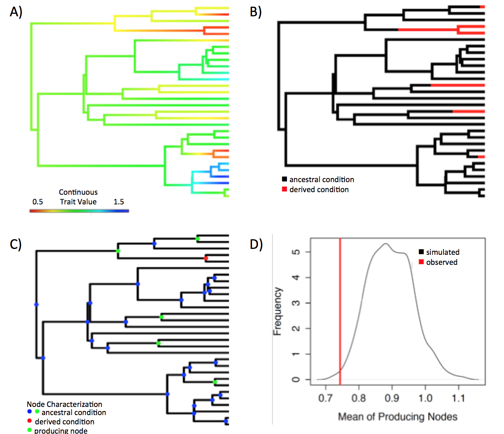

_______
# Installing

The most recent version may be installed from github using the devtools package:

Installing from github

    library(devtools)
    install_github("coleoguy/evobiR", build_vignettes = TRUE)

```{r, echo=F, tidy=T}
library(evobiR)
```

_______
# Comparative Methods

## AncCond
```{r, eval=FALSE}
data(mite.trait)
data(trees.mite)
AncCond(trees[[1]], mite.trait)
```

This function uses stochastic mapping and ancestral state reconstruction to determine if the derived state of a binary trait originates when a continuous trait has an extreme value.



The four steps in the ancestral condition test. A) Ancestral states are estimated for the continuous character assuming a Brownian motion model of evolution. B) Possible evolutionary histories for the discrete trait are generated through stochastic mapping C) Nodes are categorized as either ancestral or derived, and ancestral nodes that subtend an origin of the derived state of the discrete character are annotated. D) Depiction of the null distribution and the observed mean of producing nodes estimated from the data. In this example the producing nodes have a lower continuous value than expected if there is no relationship between the traits.

&nbsp;

## AncCondFast

A more rigorous version of `AncCond` that builds its null distribution using parametric bootstrapping instead of simple node resampling. Rather than shuffling real node values, this function simulates entire neutral evolutionary histories on the tree via `sim.history`, puts each through the same stochastic-mapping pipeline, and compares the real Grand Mean to the distribution of neutral Grand Means.

```{r, eval=FALSE}
library(ape)
library(phytools)
tree <- rcoal(30)
data <- data.frame(
  species = tree$tip.label,
  body_size = rnorm(30, 10, 2),
  has_horn = sample(1:2, 30, replace = TRUE)
)
# Run parametric bootstrap with 50 null simulations, 50 maps each
result <- AncCondFast(tree, data, n_iter = 50, n_maps = 50)
hist(result$null_dist, main = "Null Distribution")
abline(v = result$obs_stat, col = "red", lwd = 2)
```

&nbsp;

## GetTipRates

Estimates how fast a discrete character has been evolving at each tip of a phylogenetic tree. The rate for a tip is calculated as the absolute difference between the tip state and the reconstructed parent state divided by the branch length connecting them.

```{r, eval=FALSE}
library(ape)
library(castor)
tree <- rcoal(10)
Q <- matrix(c(-0.2, 0.1, 0.1,
               0.1, -0.2, 0.1,
               0.1, 0.1, -0.2), 3, 3)
colnames(Q) <- rownames(Q) <- c("1", "2", "3")
tip.states <- setNames(sample(1:3, 10, replace = TRUE), tree$tip.label)
rates <- GetTipRates(tree, Q, tip.states)
```

&nbsp;


&nbsp;


## FuzzyMatch
When assembling data from different sources typos can sometimes cause a loss of perfect matches between trees and datasets. This function helps you find these close matches that can be hand curated to keep as many species as possible in your analysis.

```{r}
data(hym.tree)
names <- c("Pepsis_elegans", "Plagiolepis_alluaudi", "Pheidele_lucreti", "Meliturgula_scriptifronsi", "Andrena_afimbriat")
FuzzyMatch(tree = hym.tree, data = names, max.dist=3)
```

&nbsp;


&nbsp;


## SampleTrees

```{r, eval=FALSE}
SampleTrees(trees = system.file("trees.nex", package = "evobiR"),
            burnin = .1, final.number = 20, format = 'new', prefix = 'sample')
```

This function takes as its input a large collection of trees from a program like MrBayes or BEAST and allows the user to select the number of randomly drawn trees they wish to retrieve and to save them in either Newick or Nexus format.


&nbsp;

## countTrees

Classifies each tree in a collection against a set of reference topologies and counts how many trees match each reference. This is useful after a Bayesian phylogenetic analysis when you want to know what fraction of posterior trees support each possible branching arrangement.

```{r, eval=FALSE}
result <- countTrees("posterior_trees.nwk", "candidate_topologies.nwk")
result[[1]]  # counts per reference topology
result[[2]]  # which topology each individual tree matched
```


&nbsp;


## SuperMatrix

`SuperMatrix(missing = "N", prefix = "DATASET2", save = TRUE)`

This function reads all fasta format alignments in the working directory and constructs a single supermatrix that includes all taxa present in any of the fasta files and inserts missing symbols for taxa that are missing sequences for some loci.  A list with two elements is returned. The first element contains partition data that records the alignment positions of each input fasta file in the combined supermatrix. The second element is a dataframe version of the supermatrix. If the argument save is set to TRUE then both of these files are also saved to the working directory.

&nbsp;

_______
# Phylogenetic Rate Analysis

## scaleTreeRates & plot.phyloscaled

The `scaleTreeRates` function analyzes heterogeneity in rates of discrete character evolution across a phylogeny. It estimates a scalar multiplier for each edge that modifies the overall transition rate matrix, allowing rates to vary across the tree.

```{r, eval=FALSE}
library(ape)
library(phytools)

## Fit rate heterogeneity model
tree <- rtree(20)
tip.states <- sample(1:2, 20, replace = TRUE)
names(tip.states) <- tree$tip.label
result <- scaleTreeRates(tree, tip.states, model = "ER", nbins = 3)

## Visualize with scaled branch lengths
plot(result, method = "multiply")

## Visualize with colored branches
plot(result, method = "color")
```

The `plot.phyloscaled` function provides two visualization methods: `"multiply"` scales branch lengths by their associated scalar, and `"color"` assigns colors from a diverging palette to indicate rate variation.

&nbsp;

## make.simmap2 & fix.simmap

The `make.simmap2` function is an extension of phytools' `make.simmap` that adds rejection monitoring and a maximum rejection limit per edge. When the rejection limit is exceeded, the edge is assigned a "fail" state rather than stalling the simulation. The `fix.simmap` function uses graph theory to resolve these failed edges.

```{r, eval=FALSE}
library(ape)
library(phytools)
tree <- rtree(20)
x <- sample(c("a","b"), 20, replace = TRUE)
names(x) <- tree$tip.label

## Run stochastic mapping with rejection limit
result <- make.simmap2(tree, x, model = "ER", nsim = 10,
                       monitor = FALSE, rejmax = 100000)
```


&nbsp;

_______
# Population Genetics

## CalcD & WinCalcD
The functions CalcD and CalcPopD are implementations of the algorithm for detecting introgression in genomic data. Significance of the D-statistic can be calculated either through bootstrapping or jackknifing. Bootstrapping is appropriate for datasets where SNPs are unlinked, for instance unmapped RADSeq data. Jackknifing is the appropriate approach when SNPs are potentially in linkage, for instance gene alignments or genome alignments. The WinCalcD function is identical to CalcD but performs testing in windows along an alignment.

Durand, Eric Y., et al. Testing for ancient admixture between closely related populations. Molecular biology and evolution 28.8 (2011): 2239-2252.

Eaton, D. A. R., and R. H. Ree. 2013. Inferring phylogeny and introgression using RADseq data: An example from flowering plants (Pedicularis: Orobanchaceae). Syst. Biol. 62:689-706


```{r}
CalcD(alignment = system.file("1.fasta", package = "evobiR"), sig.test = "N")

CalcPopD(alignment = system.file("3.fasta", package = "evobiR"), sig.test = "N")

```

The `WinCalcD` function is identical to `CalcD` but performs testing in sliding windows along the alignment, letting you see how introgression signal varies across the genome.

```{r, eval=FALSE}
results <- WinCalcD("my_alignment.fasta",
                    win.size = 500, step.size = 250)
plot(1:nrow(results), as.numeric(results$d), type = "l",
     xlab = "Window", ylab = "D-statistic")
abline(h = 0, lty = 2, col = "red")
```

&nbsp;

## getNe

Calculate the variance effective population size due to unequal sex ratio. Formulas are available for both autosomal loci and X chromosome loci.

```{r}
# Effective population size for autosomal locus
getNe(males = 100, females = 200)

# Effective population size for X-linked locus
getNe(males = 100, females = 200, locus = "X")
```

## pSAF

This function computes the probability that a random chromosomal fusion joins a sex chromosome to an autosome. Two null models are available: an occurrence model (Anderson et al. 2020) and a fixation-weighted model that accounts for the different effective copy numbers of autosomes, X/Z, and Y/W chromosomes.

```{r}
# Fixation-weighted probability of SA fusion for an XY system
# with 13 autosome pairs (Da = 26)
pSAF(n_auto = 13, n_x = 1, n_y = 1, mu = 0.4)

# Occurrence probability only
pSAF(n_auto = 13, n_x = 1, n_y = 1, mu = 0.4, weighted = FALSE)
```


&nbsp;

_______
# Utility/Misc. Functions

## ReOrderAlignment

Reads a FASTA alignment and writes a new file with sequences reordered by their starting position (where the first non-gap character appears). This is helpful when sequences cover different regions of a gene and you want to visualize the alignment more clearly. Optionally, reference sequences can be pinned to the top.

```{r, eval=FALSE}
ReOrderAlignment("my_alignment.fasta", "reordered.fasta")

# Pin a reference sequence to the top
ReOrderAlignment("my_alignment.fasta", "reordered.fasta",
                 ref = "reference_seq")
```

&nbsp;

## Sliding window

Applies a function within a sliding window of a numeric vector. Both the step size and the window size can be set by the user.  Sliding window analyses are important tools particularly during data exploration.  Often we can find patterns at scales that we might miss otherwise.  As an example lets look at the sunspot data included in R.

```{r, fig.height=5, fig.width=5}
data(sunspot.month)
foo <- as.vector(sunspot.month)
plot(foo, ylab="Number of sunspots", xlab="record number")
```

When we look at the data at this scale the pattern that really catches our attention is the 25 peaks that we see across these 260 years.  This is the well documented 11-year sunspot cycle.  However, our sun has longer cycles that are less evident in this graphing.

```{r, fig.height=5, fig.width=5}
# first lets use the sliding window function to get the number sun spots

# average over 11 years and do this moving in 1 year steps through time
sunspots <- SlidingWindow(FUN = "mean",
                          data = foo,
                          window = 132,
                          step = 12,
                          strict = F)

# generate year labels using the length of the data
n.months <- length(foo)
start.year <- 1749
year.seq <- rep(start.year:(start.year + ceiling(n.months/12) - 1), each = 12)[1:n.months]
years <- round(SlidingWindow("mean",
                             data = year.seq,
                             window = 132,
                             step = 12,
                             strict=F))
{plot(x=years,y=sunspots, type="l", lwd=3)
abline(v=1810, col="red",lwd=3)
text(y=90, x=1810, "Dalton Min.", col="red",pos=4)}
```

Now we can easily spot just how exceptional the Dalton minimum of the early 1800s was.

&nbsp;

## ResSel

This function takes measurements of multiple traits and performs a linear regression and identifies those records with the largest and smallest residual. Originally it was written to perform a regression of horn size on body size allowing for high and low selection lines.  It allows users to choose the trait to select on and the trait to control for.  It also lets the user choose the number of individuals selected (strength of selection).

```{r}
data <- read.csv(file = system.file("horn.beetle.csv", package = "evobiR"))
```
The first column of the data file should contain the identifier i.e. the specimen ID or vial that the measurement is from while the traits should be in the next two columns.

```{r}
data[1:10,]
```

We can then run the residual selection function and it will provide us with both a visual depiction of the data and will return a list with elements (high line and low line) providing us with ID numbers of selected individuals.

```{r, fig.height=5, fig.width=5}
ResSel(data = data, traits = c(2,3), percent = 15, identifier = 1, model = "linear")
```


&nbsp;

____
For questions or comments contact [Heath Blackmon](mailto:coleoguy@gmail.com)
