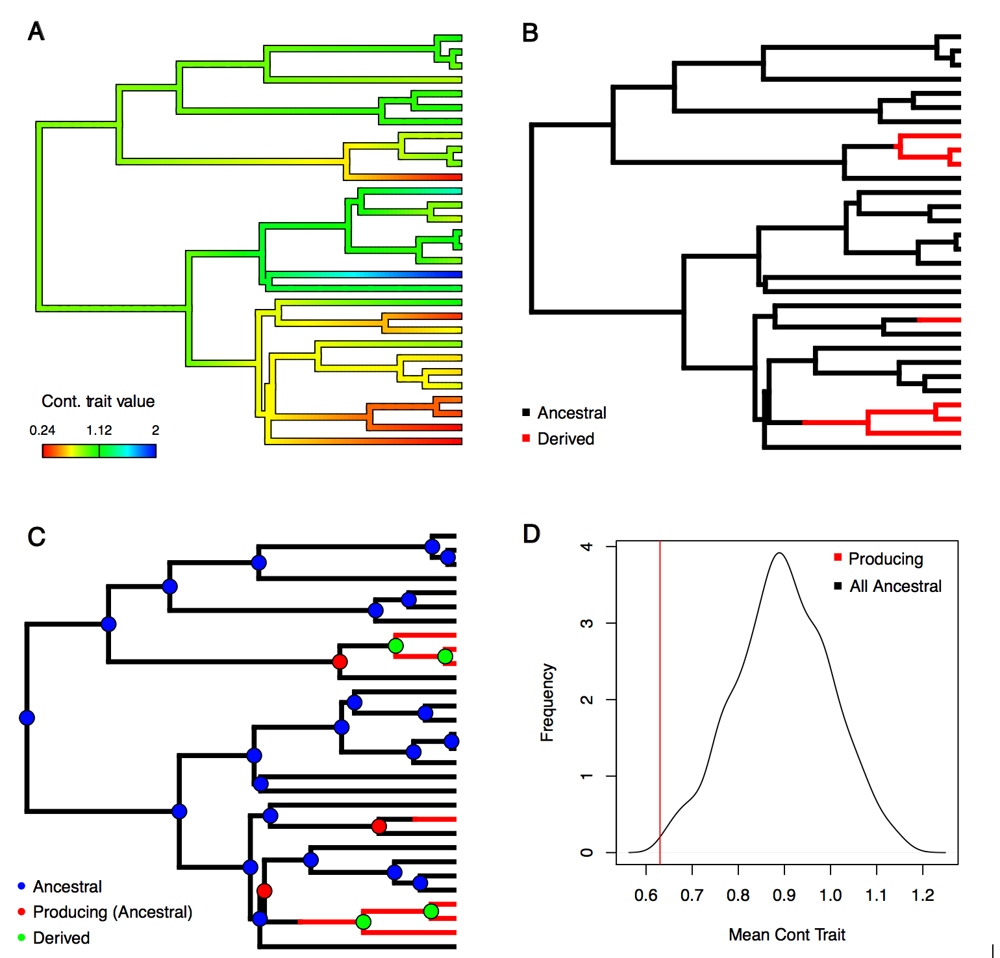

_______
# Installing

A stable tested version of evobiR is available from the CRAN repository or the most recent version may be installed from github using the devtools package: 

Installing from CRAN

    install.packages("evobiR")

Installing from github

    library(devtools)
    install_github("coleoguy/evobiR", build_vignettes = TRUE)

```{r, echo=F, tidy=T}
library(evobiR)
```

_______
# Introduction

evobiR is general package that contains a variety of functions to facilitate comparative and population genetics analyses.

# Comparative Methods

## AncCond: 
```{}
data(mite.trait)
data(trees.mite)
AncCond(trees, mite.trait, iter=100) 
```

This function uses stochastic mapping and ancestral state reconstruction to determine if the derived state of a binary trait originates when a continuous trait has an extreme value.
 


Depiction of the four steps in our approach to estimating the probability of the continuous value associated with the origin of a transition into a derived state of a binary  character.  A) Estimation of the continuous trait assuming a Brownian motion model of evolution. B) Identification of the transition points in the binary character through stochastic mapping C) Categorization of nodes as either ancestral or derived as well as those that have a daughter lineage experiencing an origin of the derived state of the binary character. D) Depiction of the null distribution from sampling continuous trait value at nodes in ancestral condition compared to the observed mean of producing nodes estimate from the data.

&nbsp;


## CDC model
This function implements a model for the dependent evolution of a discrete traits.  It uses a hidden state in one binary trait (A vs a) and allows users to test whether transitions in a second binary trait (B or b) occur primarily right after transitions in from A to a.  The model has either 3 or 4 parameters.  

 - rate 1 is transitions from A to a1

 - rate 2 is transitions from a1 to a2

 - rate 3 is transitions from B to b on the A background

 - rate 4 is transitions from B to b on the a1 background

 - rate 5 is transitions from b to b on the a2 background

We implement three version:

 - if the model argument is set to 344 then rate 4 and rate 5 are constrained to be equal
 
 - if the model argument is set to 343 then rate 4 and rate 5 are constrained to be equal

 - if the model argument is set to 333 then rate 4 and rate 5 are constrained to be equal

We interpret the results by comparing AIC values if 333 has the lowest AIC then we infer that the evolution of trait B is not correlated in any way with the evolution of trait A.  If model 344 has the lowest likelihood then we infer that trait B has a Pagel style correlation with trait A, and finally if model 343 has the lowest AIC then we infer that we change dependent character evolution.  Where transitions in A lead to temporary increases in the rate that B evolves.
 

```{r}
load(url("http://coleoguy.github.io/comparative/pagel.data.sets.RData"))
tree <- set.phy[[1]]
x <- unrepburst1[[1]]
y <- unrepburst2[[1]]
rm(set.phy, perfrep1, perfrep2, unrepburst1, unrepburst2, 
   state.darwin1, state.darwin2, transitioned1, transitioned2, 
   dependant.data1, dependant.data2, 
   independant.data2, independant.data1)
result344 <- cdcModel(x, y, tree, model=344)
result343 <- cdcModel(x, y, tree, model=343)
result333 <- cdcModel(x, y, tree, model=333)
# now lets look at likelihoods
result333$lnLik
result343$lnLik
result344$lnLik
```

We can see that the rates of evolution are likely correlated.  The model where we force the rates in y to be the same regardless of the state of x appears poor.  Lets account for differences in the number of parameters by looking at the AIC values


```{r}
AIC(result333)
AIC(result343)
AIC(result344)
```

Looking at these it is easy to see that our trait y is evolving at a different rate in the two states of x but that there is no support for differences in the rate that Y evolves within state 2 of trait x.
 
 
&nbsp;
 

 
## FuzzyMatch
When assembling data from different sources typos can sometimes cause a loss of perfect matches between trees and datasets. This function helps you find these close matches that can be hand curated to keep as many species as possible in your analysis.

```{r}
data(hym.tree)
names <- c("Pepsis_elegans", "Plagiolepis_alluaudi", "Pheidele_lucreti", "Meliturgula_scriptifronsi", "Andrena_afimbriat")
FuzzyMatch(tree = hym.tree, data = names, max.dist=3)
```

&nbsp;
 

## ReorderData

This function takes a vector, matrix, or dataframe and reorders the data to match the order of tips in a phylo object.  Some R packages require that tips on a tree and data in vector or matrix be in the same order, other require them to be named the same, still others require that both of these are true.  Assuming your names match but the order is different this will reorder the data to match your tree.

```{r}
data(mite.trait)
data <- mite.trait
data(trees.mite)
tree <- trees[[1]]
species <- cbind(as.character(data[, 1])[1:5],
                 tree$tip.label[1:5])
colnames(species) <- c("data", "tree")
species
```

here we can see that the tree and data are not in the same order

```{r}
new.data <- ReorderData(tree, data, taxa.names=1)
species<- cbind(as.character(data[, 1])[1:5], as.character(new.data[, 1])[1:5],
                 trees[[1]]$tip.label[1:5])
colnames(species) <- c("old.data", "new.data", "tree")
species
```

now we can see that our data and our tree are in the same order.

&nbsp;

## SampleTrees

```{r, eval=F}
SampleTrees(trees = system.file("trees.nex", package = "evobiR"), 
            burnin = .1, final.number = 20, format = 'new', prefix = 'sample')
```

This function takes as its input a large collection of trees from a program like MrBayes or Beast and allows the user to select the number of randomly drawn trees they wish to retrieve and to save them in either newick or nexus format.

&nbsp;


## ShowTree

```{r}
data(mite.trait)
data(trees.mite)
ShowTree(tree = trees[[1]], tip.vals = mite.trait[,3], tip.cex = .5, type = "fan")
```

This function takes as its input a tree and discrete tip data and plots both together.  Basically just automates the combination of APEs plot and tiplabel functions.  Under its default options it will utilize the color blind friendly color palette viridis and pick colors equally distant from each other

&nbsp;


 
## SimThresh3
This is an extension of Felsenstein's threshold model for a 3 state unordered trait. This assumes that a 2 dimensional liability value determines which of 3 discrete states is observed. The liabilities are allowed to evolve on an X and Y axis and then projected onto a Cartesian plane. This plane is divided into three sectors that meet at the origin. The discrete trait observed is determined by which sector the X,Y values fall in: 330 to 90 degrees is state 1, 90 to 210 degrees is state 2, and 210 to 330 is state 3. This approach allows for any set of probabilities for transitions between states to be represented.

To illustrate first we will simply simulate the tree and the data
```{r}
set.seed(3)
tree<-phytools::pbtree(n=100)
tip.state.full <- SimThresh3(tree, liabilities=T)
```

Now lets plot liabilities that have evolved via Brownian motion onto a Cartesian plane, and add lines to represent the thresholds between traits:
```{r, fig.width=6, fig.height=6}
plot(tip.state.full[[2]],tip.state.full[[3]], 
     col=c("red", "blue", "green")[tip.state.full[[1]]], pch=16, cex=.6,
     xlim=c(-4,4), ylim=c(-4,4), 
     xlab="Liability 1", ylab="Liability 2")
lines(x=c(0,0), y=c(0,4), lwd=3, lty=3)
lines(x=c(0,4), y=c(0,-2.31), lwd=3, lty=3)
lines(x=c(0,-4), y=c(0,-2.31), lwd=3, lty=3)
text(x=c(-2,0,2), y=c(3,-3,3), labels=c("state 1", "state 2", "state 3"), cex=.75)
```

Alternatively we can view the outcome of this model on our tree:
```{r, fig.width=2, fig.height=6}
ShowTree(tree, tip.state.full[[1]],  cols = c("red", "blue", "green"), tip.cex=.5)
```

&nbsp;


## SuperMatrix

`SuperMatrix(missing = "N", prefix = "DATASET2", save = T)`

This function reads all fasta format alignments in the working directory and constructs a single supermatrix that includes all taxa present in any of the fasta files and inserts missing symbols for taxa that are missing sequences for some loci.  A list with two elements is returned. The first element contains partition data that records the alignment positions of each input fasta file in the combined supermatrix. The second element is a dataframe version of the supermatrix. If the argument save is set to True then both of these files are also saved to the working directory.

&nbsp;

_______
# Population Genetics

## CalcD & WinCalcD
The functions CalcD and CalcPopD are implementations of the algorithm introgression in genomic data. Significance of the D-stat can be calculated either through bootstrapping or jackknifing. Bootstrapping is appropriate for datasets where SNPs are unlinked for instance unmapped RADSeq data. Jackknifing is the appropriate approach when SNPs are potentially in linkage for instance gene alignments or genome alignments.

Durand, Eric Y., et al. Testing for ancient admixture between closely related populations. Molecular biology and evolution 28.8 (2011): 2239-2252.

Eaton, D. A. R., and R. H. Ree. 2013. Inferring phylogeny and introgression using RADseq data: An example from flowering plants (Pedicularis: Orobanchaceae). Syst. Biol. 62:689-706


```{r}
CalcD(alignment = system.file("1.fasta", package = "evobiR"), sig.test = "N")

CalcPopD(alignment = system.file("3.fasta", package = "evobiR"))

```


&nbsp;

_______
# Utility/Misc. Functions

## AICc
Supplied with a log likelihood, the number of model parameters, and sample size calculates the small sample size version of the AIC score. In my opinion this is preferable in general use since it will converge on AIC as sample size increases and reduces the risk of overfitting otherwise.  Below we can illustrate this convergence using the R cars dataset and a simple linear model.

```{r, fig.height=5, fig.width=5}
data(cars)
fit<-lm(cars)
aic <- AIC(fit)
plot(0,0,xlim=c(0,50),ylim=c(250,270),xlab="sample size", 
     main="model with 3 param.", ylab="Score (AIC/AICc)")
abline(h=aic, col="red", lwd=3)
foo <- vector(length=100, mode="numeric")
for(i in 3:100){
  foo[i] <- AICc(-127.3877, 3, i)
}
lines(foo, col="darkgreen", lwd=3)
text(x=c(3,13),y=c(259,268),c("AIC","AICc"))
```

&nbsp;

## Even

Just a simple function that returns True if a number is even and False otherwise.

```{r}
Even(3)
Even(4)
```

Internally this is just does a quick modulo 2 division:
```{r}
3 %% 2 == 0
4 %% 2 == 0
```

&nbsp;

## Mode

Returns the most frequently occurring value in a vector. In the case of a tie it will return the mode which has the earliest initial occurrence in the vector

```{r}
Mode(c(1,2,3,4,5,6,2,5))
Mode(c("jeff", "emma", "matt", "laura", "matt"))
```

&nbsp;

## Sliding window

Applies a function within a sliding window of a numeric vector. Both the step size and the window size can be set by the user.  Sliding window analyses are important tools particularly during data exploration.  Often we can find patterns at scales that we might miss otherwise.  As an example lets look at the sunspot data included in R.

```{r, fig.height=5, fig.width=5}
data(sunspot.month)
foo <- as.vector(sunspot.month)
plot(foo)
```

When we look at the data at this scale the pattern that really catches our attention is the 25 peaks that we see across these 260 years.  This is the well documented 11-year sunspot cycle.  However, our sun has longer cycles that are less evident in this graphing.

```{r, fig.height=5, fig.width=5}
# first lets use the sliding window function to get the number sun spots 

# average over 11 years and do this moving in 1 year steps through time
sunspots <- SlidingWindow(FUN = "mean", 
                          data = foo, 
                          window = 132, 
                          step = 12, 
                          strict = F)

# we repeat this on the years so we can plot agains a sensible x axis
years <- round(SlidingWindow("mean", 
                             data = rep(1749:2013, each=12)[1:3177], 
                             window = 132, 
                             step = 12, 
                             strict=F))
plot(x=years,y=sunspots, type="l", lwd=3)
abline(v=1810, col="red",lwd=3)
text(y=90, x=1810, "Dalton Min.", col="red",pos=4)
```

now we can easily spot just how exceptional the Dalton minimum of the early 1800s was.

&nbsp;

## ResSel

This function takes measurements of multiple traits and performs a linear regression and identifies those records with the largest and smallest residual. Originally it was written to perform a regression of horn size on body size allowing for high and low selection lines.  It allows users to choose the trait to select on and the trait to control for.  It also lets the user choose the number of individuals selected (strength of selection).

```{r}
data <- read.csv(file = system.file("horn.beetle.csv", package = "evobiR"))
```
The first column of the data file should contain the identifier i.e. the specimen ID or vial that the measurement is from while the traits should be in the next two columns.

```{r}
data[1:10,]
```

We can then run the residual selection function and it will provide us with both a visual depiction of the data and will return a list with elements (high line and low line providing us with ID numbers of selected individuals.

```{r, fig.height=5, fig.width=5}
ResSel(data = data, traits = c(2,3), percent = 15, identifier = 1, model = "linear")
```


&nbsp;

____
For questions or comments contact [Heath Blackmon](mailto:coleoguy@gmail.com)
